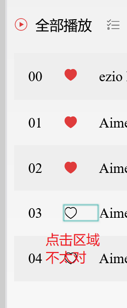
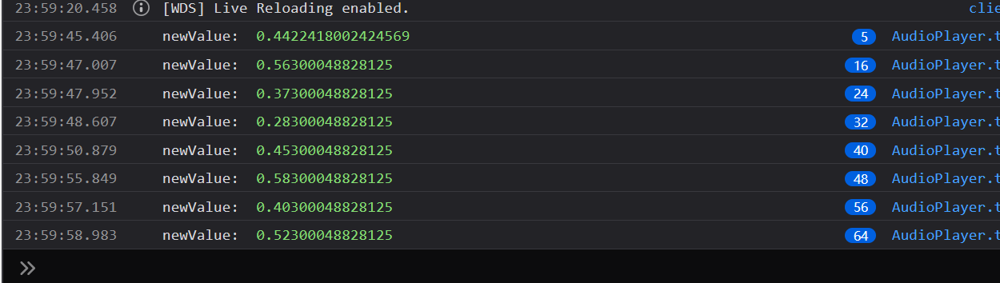

TODO 列表：

- 需要在样式上定义一个设计元素的系统，
- 为了看上去更清晰，所有组件的 Props 要单独提出，以方便阅读源代码
- 微信小程序的组件设计牛逼，不照抄一下吗？
- 设计 hooks 系统（分层的）
- （已完成）为各个数据类型的 util（比如 forArray）创造包装函数，以便使用下角标点符，提升语义顺序的流畅性
- （已完成）ArrayUtil 欠缺集合操作的方法，求交集、并集、差集等
- 需要编写 utils 的单元测试代码
  TODO 
  FIXME 
- 通过 web worker 载入 Audio，提升性能
